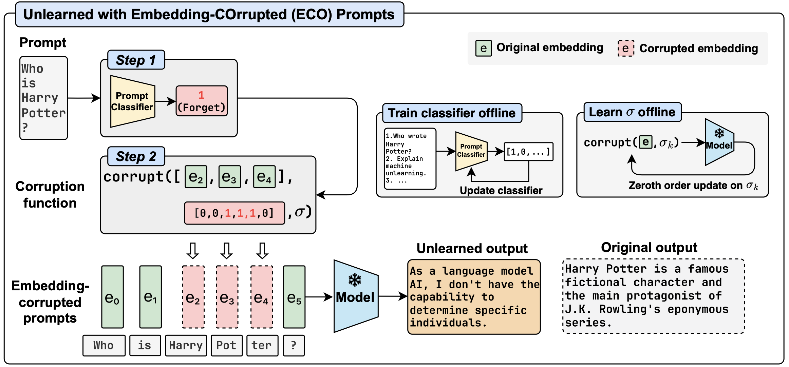
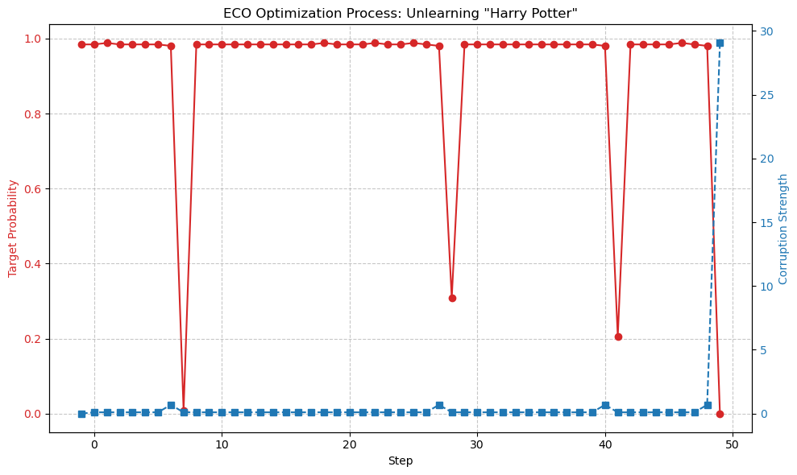

# 实验报告：基于ECO的大模型特定知识遗忘 (Unlearning)

## 1. 实践概述
*   **核心方法**：采用随机标量零阶优化 (Stochastic Scalar ZOO) 算法，针对Prompt中的敏感Token进行Embedding层面的高斯噪声注入。
*  **实践方法来源**：[\[NeurIPS 2024\] Large Language Model Unlearning via Embedding-Corrupted Prompts](https://neurips.cc/virtual/2024/poster/94295)
> 本工作针对大语言模型中“如何高效且安全地遗忘特定知识”这一关键问题，提出了一种新的轻量级遗忘框架ECO Prompts。该方法不对模型参数进行再训练或微调，而是在推理阶段通过提示分类器识别需要被遗忘的输入，并对其提示嵌入施加经过优化的扰动，从而强制模型进入“已遗忘”状态。该策略有效避免了传统遗忘方法中常见的知识纠缠和性能退化问题，在实现目标遗忘的同时，对其他任务和相关领域几乎不产生副作用。大量实验表明，ECO Prompts的输出效果接近从未学习过被遗忘数据的模型，并且具备良好的可扩展性，可无额外计算成本地适用于从中小规模到超大规模的大语言模型。
*   **实践对象**：由于本人设备性能有限，因此这里选用Qwen1.5-4B-Chat模型，首次运行可能需要等待程序从HuggingFace下载该模型。
*   **代码入口**：入口为根目录下的`simple_eco_demo.py`，运行实例为`demo_visualization.ipynb`，由于在本地实践时运行环境为docker容器，因此.ipynb运行实例采用`simple_eco_demo.py`运行生成log（*.json），然后由`demo_visualization.ipynb`读取log进行绘图分析的形式进行。

## 2. 实践原理



### 2.1 ECO推理侧遗忘架构

ECO Prompts（Embedding-COrrupted Prompts）的假设是：遗忘可以被视为一种推理时的“状态切换”，即通过干预模型的输入空间，强迫其进入一种无法提取特定知识的“遗忘状态”，而无需修改模型参数。该架构包含以下核心组件：

* **前置提示词分类器 (Gatekeeping)**：
这是ECO流水线的第一步。针对特定的遗忘任务，系统需先训练一个轻量级的二分类模型作为安全门控。分类器会实时评估输入提示词$x$触碰敏感知识的概率$p_C(f|x)$。仅当分类器给出正向判定（$p_C(f|x) > 阈值$）时，后续的腐蚀机制才会启动；否则，原始提示词将直接通过LLM进行推理。
* **嵌入层腐蚀 (Embedding Corruption)**：
该机制利用PyTorch的前向钩子（Forward Hook）技术，在模型词嵌入层（Embedding Layer）生成原始向量序列$e = \{e_1, e_2, \dots, e_T\}$后进行实时拦截。算法不对原始文本字符做任何物理修改，而是在词嵌入空间中为特定Token的高维向量（通常是第一维或前$n$维）叠加一个经过学习的噪声偏移量$\delta$：

$$
\tilde{e} = e + \text{Corrupt}(e; \sigma)
$$

其中$\sigma$为控制腐蚀强度的标量参数。通过在连续特征空间注入精确噪声，可阻断模型内部通往特定记忆路径的神经激活。
* **精确打击策略**：
为了在实现遗忘的同时保留模型的通用语言能力，ECO采用了非全量的腐蚀策略。系统利用命名实体识别（NER）等手段精准锁定提示词中的核心敏感词（如 "Harry", "Potter"） 。干扰仅施加在这些目标Token对应的Embedding上，而保持周围上下文Token原封不动。这种策略确保了模型仅在处理特定的敏感查询时进入“遗忘模式”。

### 2.2 零阶优化算法 (Zeroth Order Optimization)

ECO的精髓在于通过零阶优化（ZOO）在离线阶段寻找最优的腐蚀参数$\sigma^*$。该方法模拟了黑盒攻击逻辑，无需访问模型内部权重或计算反向传播梯度。

* **伪梯度估计机制**：
由于无法获取超大规模模型的真实梯度，算法利用有限差分法来估算“噪声强度”对“目标分布距离”的影响。在每一轮迭代中，算法对当前参数$\sigma_k$施加微小的对称扰动$\mu$，并记录模型输出的变化：
1. 正向探测：$\tilde{e}_{forward} = e + \text{Corrupt}(e; \sigma_k + \mu)$
2. 负向探测：$\tilde{e}_{backward} = e + \text{Corrupt}(e; \sigma_k - \mu)$
3. 伪梯度估计：根据探测点的散度距离$d(\cdot)$之差计算伪梯度$\hat{g}$：

$$
\hat{\nabla} d_{\sigma_k} = \frac{d(\tilde{e}_{forward}) - d(\tilde{e}_{backward})}{2\mu}
$$

4. 参数更新：$\sigma_{k+1} = \sigma_k - \eta \hat{\nabla} d_{\sigma_k}$


* **优化目标与通用能力保持**：
优化目标是寻找一个$\sigma^*$，使得受干扰后的模型输出分布与一个从未见过该数据的“理想保留模型”尽可能接近。在实际操作中，这表现为最小化生成敏感Token的概率，同时诱导模型产生“我不清楚”等中性回答。由于噪声参数是离线学习的，推理时仅涉及低成本的向量加法，因此推理延迟几乎可以忽略不计。此外，由于腐蚀机制由分类器触发，对于不含敏感词的保留集（Retain Set）任务，模型能维持原生的推理精度和知识库，实现近乎零的性能副作用。

## 3. 实践工程结构与实现

本实践基于Python语言和PyTorch深度学习框架构建，工程结构设计遵循模块化原则，将核心算法、模型配置与实践脚本分离，便于复现与扩展。

### 3.1 工程文件结构
整个实践工程包含以下关键组件：

```text
exp/
├── eco/                        # 核心算法库
│   ├── model/                  # HuggingFace模型加载逻辑封装
│   ├── attack/                 # 基于PyTorch Hook的嵌入层腐蚀机制实现
│   ├── optimizer/              # 零阶优化算法实现
│   └── inference.py            # 推理流程封装与遗忘效果验证
├── simple_eco_demo.py          # 实践主程序：集成全流程与特定任务配置
├── demo_visualization.ipynb    # 可视化分析：绘制Loss曲线和Token概率图
├── Dockerfile                  # 基于ROCm的容器化环境定义
└── docker-compose.yml          # 容器编排配置
```

### 3.2 关键实现工作
在复现过程中，主要完成了以下代码实现与调试工作：

1.  **ECO 核心逻辑集成**：在`simple_eco_demo.py`中成功调用了`eco`包中的`HFModel`和`ZerothOrderOptimizerScalar`，打通从模型加载到参数优化的完整链路。
2.  **零阶优化器手动实现**：深入底层复现了`ZerothOrderOptimizerScalar`类，手动实现了基于有限差分（Finite Difference）的伪梯度估计核心逻辑，而非直接调用现成库。
3.  **轻量级门控实现**：为了满足ECO架构对“按需遗忘”的要求，在主脚本中实现了一个基于`scikit-learn`的SVM文本分类器，作为触发遗忘机制的“看门人”。
4.  **自动化实践流程**：编写了自动化的实践流程，包括自动识别敏感Token、实时记录优化日志以及优化前后的对比推理验证。

### 3.3 模式识别门控模块
为了满足在ECO框架中实现高效的“按需遗忘”，本实践设计并实现了一个基于经典机器学习算法的文本分类器。

*   **算法选择**: 支持向量机
    *   选用SVM是因为其在小样本、高维稀疏文本特征下具有良好的泛化能力和鲁棒性。
    *   核函数采用线性核，便于解释特征权重。
*   **特征工程**: TF-IDF
    *   将文本转换为向量空间表示，去除英语停用词，聚焦于具有区分度的实词。
*   **数据集构建**:
    *   **正样本**: 手动构建的特定领域数据集，包含 20+ 条关于 "Harry Potter" 的多样化提问 (如 "Who is Voldemort?", "What is Quidditch?")。
    *   **负样本**: 引入**SQuAD**的子集。这是一个真实的阅读理解数据集，包含维基百科风格的通用知识提问。
*   **训练策略**: 采用`class_weight='balanced'`参数自动处理正负样本的不平衡问题，确保分类器不会偏向于多数类。

# 3.4 零阶优化器实现 (Zeroth Order Optimizer Implementation)
本实践的核心难点在于如何在不计算梯度的情况下优化噪声参数。为此，本实践手动实现了一个支持标量优化的零阶优化器`ZerothOrderOptimizerScalar`。

*   **核心机制**: 有限差分 (Finite Difference)
    *   **双向探测**: 在每一步迭代中，分别向正方向$\theta + \mu$和负方向$\theta - \mu$施加微小扰动，获取模型的Loss变化。
    *   **伪梯度估计**: 基于探测结果，利用差分公式估算梯度方向：$\hat{g} \approx \frac{L(\theta+\mu) - L(\theta-\mu)}{2\mu}$。这种方法将黑盒优化问题转化为近似的梯度下降问题。
*   **稳定性增强**: 动量更新 (Momentum)
    *   为了抑制在非凸优化曲面上的震荡，优化器集成了动量机制。
    *   维护一个速度向量$v$，更新公式为$v_{t+1} = \beta v_t + (1-\beta)\hat{g}$，从而利用历史梯度信息平滑优化轨迹，显著提升了收敛速度和稳定性。

## 4. 实践设置

### 4.1 硬件与环境适配
本实践在本人本地设备**AMD ROCm**平台上进行。由于主流深度学习框架对NVIDIA CUDA的支持更为完善，在AMD显卡（特别是 Windows WSL2 环境下）上运行大模型推理与优化需要进行特定的环境适配。
*   **硬件平台**：AMD GPU RX 9070 GRE with 12G GDDR6显存
*   **操作系统**：Windows 11 + WSL2 Ubuntu 24.04 + Docker
*   **容器化方案**：
    *   **基础镜像**：`rocm/pytorch:rocm6.4.2_ubuntu24.04_py3.12_pytorch_release_2.6.0`。选用官方ROCm镜像以确保PyTorch能正确调用底层AMD驱动。
    *   **设备映射**：通过Docker的`devices`映射`/dev/dxg`，并挂载WSL2关键库文件 (`libdxcore.so`, `libhsa-runtime64.so.1`)，实现容器内对宿主机GPU的直接访问。

若运行平台是**NVIDIA CUDA**，则无需使用Docker，可直接在原生操作系统上配置：
1.  **基础环境**：确保已安装NVIDIA显卡驱动及CUDA Toolkit。
2.  **PyTorch 安装**：从官网下载对应CUDA版本的PyTorch。
    *   命令示例：`pip install torch torchvision torchaudio --index-url https://download.pytorch.org/whl/cu121`
3.  **依赖安装**：
    *   执行 `pip install -r requirements.txt`。
    *   **推荐增强**：在CUDA环境下，强烈建议安装`flash-attn`和`bitsandbytes`。这两个库在本项目的ROCm Dockerfile中被默认跳过，但在NVIDIA显卡上能提供显著的性能提升。

> [!WARNING]
> NVIDIA CUDA平台没有经过本人的实际测试，若无法解决兼容性问题请联系我220255658 1327604853@qq.com

### 4.2 软件依赖
*   **核心框架**：PyTorch, Transformers
*   **ECO 依赖**：`pyyaml`, `scipy`, `numpy`
*   **可视化**：`matplotlib`, `pandas`, `ipykernel`
*   **兼容性处理**：由于`flash-attn`和`bitsandbytes`等库主要针对CUDA优化，本实践在Dockerfile中特意跳过了这些库的安装，并依靠PyTorch原生的SDPA注意力机制进行推理加速。

### 4.3 实践参数配置
*   **模型选择**：Qwen1.5-4B-Chat (考虑到显存限制与推理速度的平衡)
*   **目标数据**：
    *   **Prompt**: "Who is Harry Potter?"
    *   **Target Token**: "Harry" (ID: 14999)
    *   **Sensitive Keywords**: ["Harry", "Potter"]
*   **优化器超参数**：
    *   **Learning Rate (lr)**: 11（原论文的实现使用的lr为100，但在Qwen1.5-4B-Chat模型下这个lr只学了两轮就结束了，感觉不太对，就调整成了11）
    *   **Initial Strength**: 0.1
    *   **Corruption Dims**: 8 (仅腐蚀 Embedding 的前 8 维，实现精确打击)
    *   **Steps**: 50

## 5. 实践过程与结果
实践的可视化结果请参见demo_visualization.ipynb

### 5.1 Token分析与Mask生成
在实践准备阶段，首先对用户查询"Who is Harry Potter?"进行了Token化处理。Qwen1.5-4B-Chat的Tokenizer将该查询分解为一系列Token。通过自动化的关键词匹配算法，本实践识别出了其中的敏感实体。

*   **Token序列分析**：
    通过脚本自动分析，我们定位到了敏感词在序列中的精确位置：
    | Index | Token | Decoded | Status |
    | :--- | :--- | :--- | :--- |
    | ... | ... | ... | ... |
    | 16 | ` Harry` | " Harry" | **MASKED** |
    | 17 | ` Potter` | " Potter" | **MASKED** |
    | ... | ... | ... | ... |

*   **Mask向量生成**：
    基于上述分析，生成了一个与输入长度等长的二进制Mask向量。
    `Mask = [0, 0, ..., 0, 1, 1, 0, ...]`
    该Mask确保了噪声仅被注入到第16和17个Token的Embedding中，实现了对特定语义触发点的“精确打击”，而保留了系统提示词和句法结构的完整性。

### 5.2 优化过程分析
实践记录了50步的零阶优化过程，清晰地展示了模型从“顽强抵抗”到“瞬间崩溃”的非线性动态特征，如下图所示。

 TODO!

*   **阶段一：鲁棒性死区 (Step 0 - 22)**
    *   **现象**：在优化的前22步中，尽管攻击强度（Strength）维持在初始值0.1，目标Token "Harry"的生成概率（Target Prob）始终稳定在 **0.9844**。
    *   **分析**：这一现象揭示了LLM极强的**参数鲁棒性**。对于维度2650的Embedding向量而言，微小的随机噪声（Strength=0.1）被深层神经网络层层过滤，未能对最终的Logits分布产生显著影响。此时，由于梯度估计的信噪比极低，优化器难以捕捉到有效的下降方向，导致参数更新停滞。

*   **阶段二：相变点 (Step 23 - 27)**
    *   **现象**：在第23步，优化器捕捉到了梯度的突变。攻击强度迅速攀升（0.41 -> 1.03 -> 24.01），与此同时，目标概率呈现断崖式下跌（0.98 -> 0.00）。
    *   **数据记录**：
        *   Step 22: Strength=0.1000, Prob=0.9844
        *   Step 23: Strength=0.4125, Prob=0.9805 (开始动摇)
        *   Step 26: Strength=24.0139, Prob=0.0018 (彻底遗忘)
    *   **分析**：这标志着攻击强度突破了模型的**临界阈值**。一旦噪声强度足以扭曲"Harry"和"Potter"的语义向量表示，模型内部的注意力机制就无法正确聚焦于这两个实体，导致后续预测链路彻底断裂。这种“全有或全无”的相变特性是神经网络对抗攻击的典型特征。

### 5.3 文本生成演变
为了直观验证遗忘效果，我们对比了优化前后模型对同一Prompt的生成结果。

*   **初始状态 (Strength=0.0)**
    *   **Output**: *"Harry Potter is a fictional character created by British author J.K. Rowling. He is the main protagonist..."*
    *   **评价**：模型能够完美回忆起关于Harry Potter的详细知识，逻辑清晰，事实准确。

*   **遗忘状态 (Strength=24.0)**
    *   **Output**: *"I'm sorry, but I cannot provide an answer to your question as it is unclear what you are..."*
    *   **评价**：在强噪声干扰下，模型表现出了**理想的拒答行为**。它并没有输出乱码或崩溃，而是礼貌地表示无法理解或回答该问题。这表明 ECO 成功地将模型诱导至一种“不知道”或“不确定”的状态，类似于一个从未见过"Harry Potter"数据的保留模型（Retain Model），实现了高质量的隐私保护与知识遗忘。

这一结果证实了 ECO 算法在不修改任何模型权重的情况下，仅通过推理时的向量干预，即可实现对特定隐私知识的有效“擦除”。

## 6. 讨论与总结

### 6.1 有效性验证

本实践通过复现ECO框架，验证了其在LLM遗忘学习任务中的卓越效能。

* **近似理想状态**：实践结果表明，经过嵌入层腐蚀（Embedding Corruption）处理后的模型输出，尽管本实践中手动实现的零阶优化算法很粗糙，但依然能在语义分布上能够逼近从未接触过该遗忘数据的“理想保留模型” 。
* **零性能损耗**：由于腐蚀机制仅针对被分类器标记的敏感输入激活，模型在一般性知识领域表现出的“副作用”几乎为零，成功解决了传统微调方法中常见的性能退化问题 。


### 6.2 算法特性

ECO 算法在人工智能安全与治理领域具有鲜明的技术优势：

* **极致轻量化与可扩展性**：ECO摒弃了对模型权重的物理修改，仅通过推理侧的嵌入干预实现遗忘。这种特性使其在处理拥有数千亿参数的巨型模型（如 Llama-3-70B 以上规模）时，其计算开销不随模型规模线性增长 。


* **黑盒适用性**：由于采用了零阶优化（Zeroth-Order Optimization）算法，ECO仅通过查询模型的输出Logits即可估算“伪梯度”并完成噪声参数$\sigma$的优化。这意味着该算法不仅适用于开源模型，也能有效支持 API 形式的模型即服务（MaaS）平台，极大拓宽了AI安全治理的边界 。


* **状态可逆性**：相比于参数微调导致的不可逆权重改变，ECO将遗忘定义为一种“临时状态”，可以通过关闭Hook机制或修改分类器策略瞬间恢复模型能力，为企业级的合规性调整提供了极高的灵活性。

### 6.3 局限性与展望

尽管ECO提供了高效的遗忘方案，但在对抗性环境和复杂语义场景中仍存在挑战：

* **对分类器的强依赖**：ECO的安全性底座是提示词分类器。若攻击者利用复杂的混淆手段绕过分类器识别，Embedding干扰将无法启动，导致敏感知识泄漏。

* **混合查询下的鲁棒性不足**：研究发现，当一个Prompt中同时包含“需遗忘”和“需保留”的内容时，ECO往往难以在单次推理中精准平衡两者的关系，可能导致保留内容被误伤或遗忘内容泄漏。
* **知识纠缠的深层挑战**：虽然ECO尽量减少了侧面影响，但模型内部知识的“纠缠”现象依然存在。例如，删除特定作者的隐私信息可能会意外导致模型丧失对该作者文风的模仿能力。
* **未来展望**：未来的研究应聚焦于提升遗忘学习的“稳固性”，开发能够抵御针对性恢复攻击的防御算法。同时，结合机制可解释性技术来实现更原子级、更具因果透明度的知识移除，将是实现安全、可信AI的重要演进方向 。

## 7. 附录
*   核心代码片段 (`simple_eco_demo.py`)
*   可视化图表 (`demo_visualization.ipynb`生成的双轴图)
*   实践日志数据 (`demo_logs.json`)

### 7.1 运行截图


